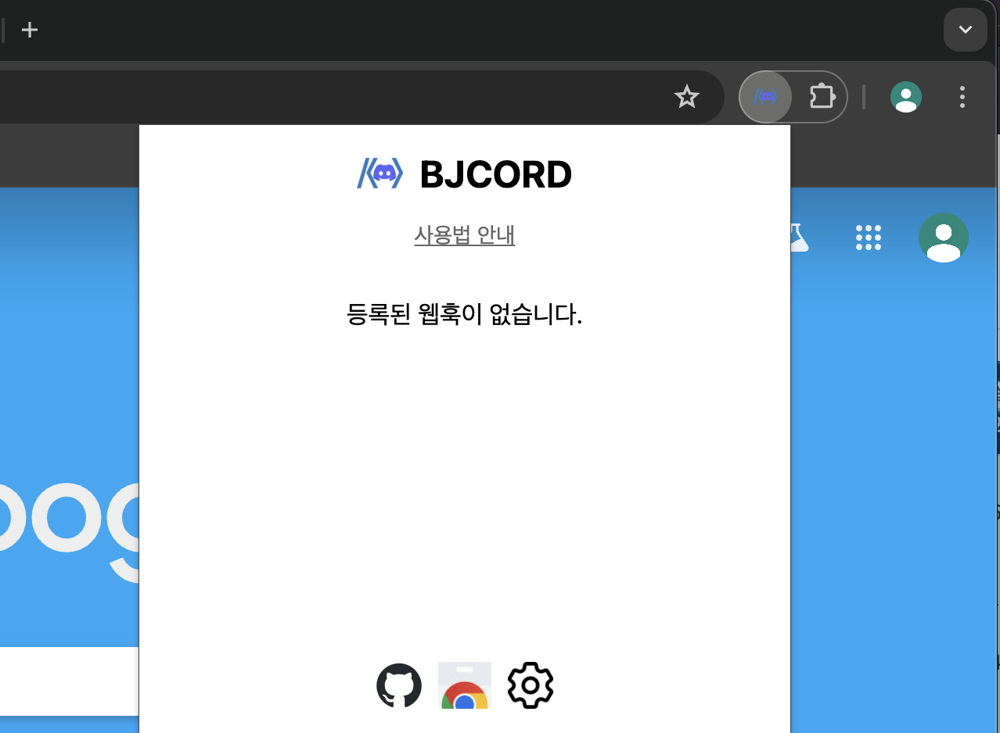
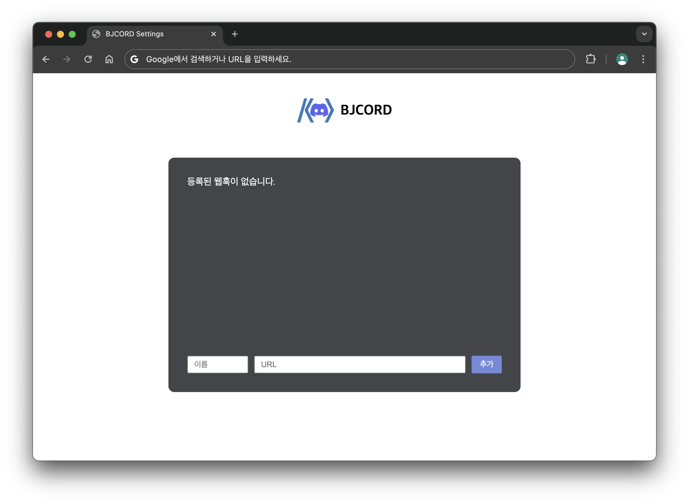
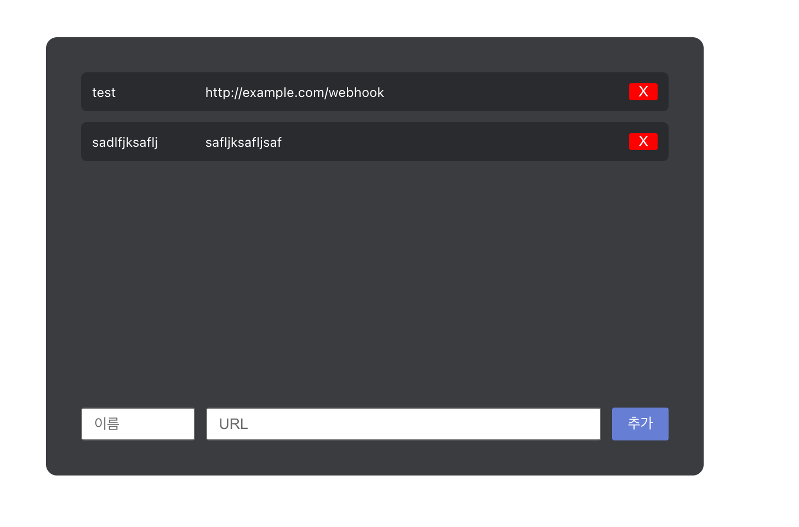
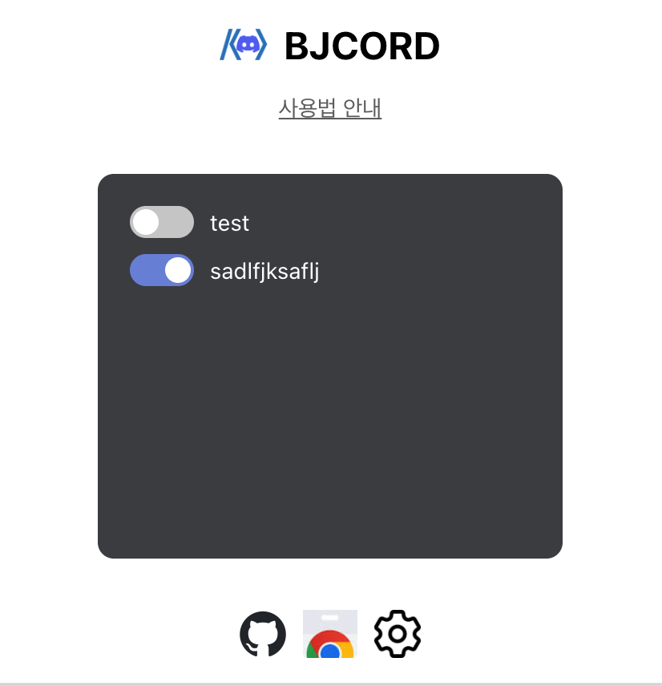
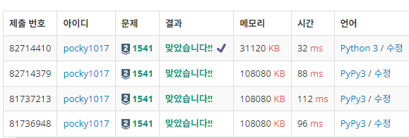
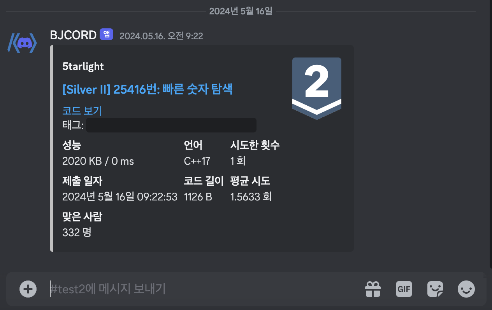
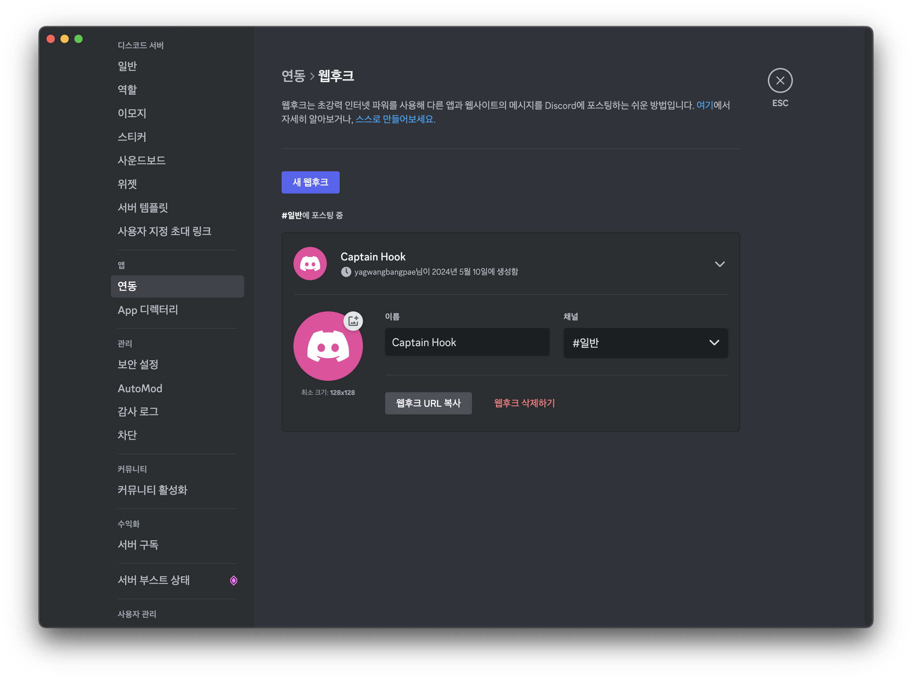
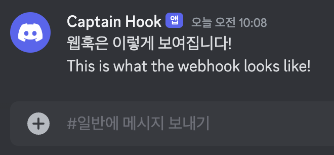

<h1 align="center">
  
   
  백준코드 | BaekjoonCord
</h1>

  Automaticaliy send your BOJ to Discord.
   
   
   
  
  
  

 

1. [**백준코드란?**](#백준코드란?)
2. [**사용 방법**](#사용-방법)
   1. [일반 사용자](#1-일반-사용자)
   2. [디스코드 서버 관리자](#2-디스코드-서버-관리자)
3. [**Contributors**](#Contributors)
    
    

## 백준코드란?

- '백준코드'는 백준에서 푼 문제를 Github에 자동으로 커밋해주는 [백준허브](https://github.com/BaekjoonHub/BaekjoonHub)를 보며 '디스코드로 보내면 어떨까?'하는 생각에서 출발한 프로젝트입니다.
- 이 프로젝트의 핵심 기능은 백준에서 푼 문제를 웹훅을 사용해 디스코드 서버로 자동으로 공유하는 것입니다.
- 이 프로그램은 특히 알고리즘 동아리나 스터디 그룹에서 문제 풀이 과정을 함께 공유하고 협력하는 데에 유용할 것입니다.
 

## 사용 방법
- 이 프로그램은 `디스코드 웹훅`을 기반으로 작동합니다.
- 웹훅은 **서버 관리자만 생성할 수 있으므로** 서버 관리자와 일반 사용자 간의 협력이 중요합니다.
- 먼저, 일반 사용자는 어떻게 사용하면 되는지 알려드리고, 서버 관리자는 어떤 작업을 해줘야 하는지 알려드리겠습니다.
 

## 1. 일반 사용자
**1. 크롬 웹스토어에서 `백준 코드`를 설치해주세요.**

설치 후 크롬 확장앱의 popup을 눌러주세요. 아직 어떠한 웹훅도 등록 되어있지 않으므로 `등록된 웹훅이 없습니다`라고 뜹니다. 팝업창의 아래쪽 톱니바퀴 모양의 아이콘을 누르면 설정 페이지로 이동이 가능합니다.
 

**2. 설정 페이지에서 `디스코드 웹훅`을 등록해주세요.**

`URL` 칸에는 디스코드 서버 관리자에게 제공받은 웹훅 URL을 입력해주시고, `이름` 칸에는 그 웹훅을 기억할 이름을 입력해주시면 됩니다. 그후 파란색 `추가` 버튼을 누르면 등록이 완료됩니다.

등록한 `웹훅 URL`과 `이름`을 삭제하려면 오른쪽에 있는 빨간 X 버튼을 눌러주세요. 

크롬 확장앱의 팝업창을 통해서 간단하게 제어할 수도 있습니다. 이 화면에는 설정 페이지에서 설정한 `이름`이 표시되며 토글 스위치를 통해 잠시 비활성화 해둘 수도 있습니다! 또한 여러 웹훅에 동시에 메세지를 보낼 수도 있습니다.
 

**3. 백준을 푸세요! 그리고 맞춘 문제를 공유하세요!**
|||
|:---:|:---:|
|맞은 문제를 인식합니다|메세지는 이런식으로 보내집니다|

`맞았습니다!`라는 문구를 인식하고 맞춘 문제를 웹훅을 통해 디스코드로 보내줍니다!
 

## 2. 디스코드 서버 관리자
**1. `서버 설정` -> `연동` -> `웹후크 만들기`를 눌러주세요.**
(서버의 주인 뿐만 아니라 관리자 권한이 있다면 누구든 가능합니다.)
 

**2. 웹훅의 프로필 사진, 이름, 보낼 채널 등을 선택해주세요.**

|||
|:---:|:---:|
|웹훅 설정화면|웹훅 메세지 예시|

웹훅은 선택한 채널에 설정한 사진과 이름으로 메세지를 보냅니다.

 

**3. `웹훅 URL`을 서버 멤버들한테 공유해주세요.**
웹훅 설정 화면의 `웹후크 URL 복사` 버튼을 누르면 웹훅의 URL을 복사할 수 있습니다. 복사한 URL을 공유하시면 됩니다!
 

## Contributors
<table>
  <tbody>
    <tr>
      <td align="center" valign="top" width="14.28%"><a href="https://github.com/5tarlight"> <b>YEAHx4</b></a>
      </td>
      <td align="center" valign="top" width="14.28%"><a href="https://github.com/karpitony"> <b>Yunseok</b></a>
      </td>
      <td align="center" valign="top" width="14.28%">
         <a href="https://github.com/rdxxer"> <b>rdxxer</b></a>
      </td>
      <!-- 당신을 위한 자리--->
      <td align="center" valign="top" width="14.28%">
      </td>
    </tr>
  </tbody>
</table>
Contributor 테이블은 항상 빈자리가 있습니다. 당신이 와서 채워주세요!
