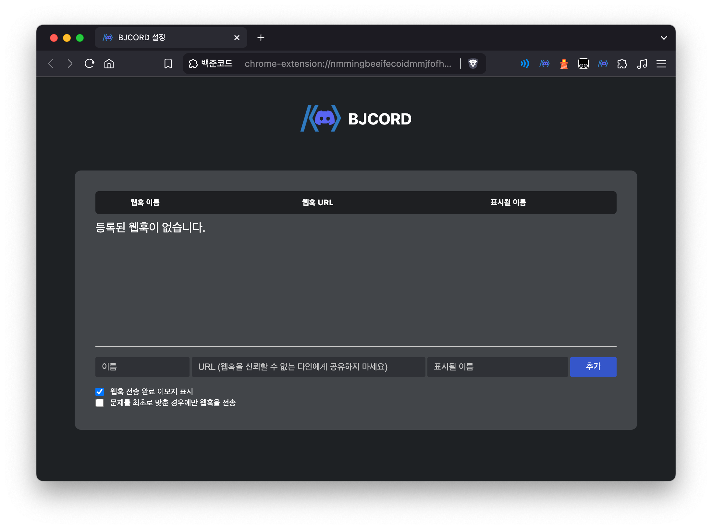

<h1 align="center">
  
  <br>
  백준코드 | BJCORD
</h1>

<p align="center">
  <font size = "5">Automaticaliy send your BOJ to Discord.</font>
  <br>
  <br>
  <br>
  <a href="LICENSE"></a>
  <a href="https://chrome.google.com/webstore/detail/ichhnkdadkmehpahpbdgcoeccfahgpdk"></a>
  <a href="https://chrome.google.com/webstore/detail/ichhnkdadkmehpahpbdgcoeccfahgpdk"></a>

</p>

<br />

1. [**백준코드란?**](#백준코드란?)
2. [**사용 방법**](#사용-방법)
   1. [일반 사용자](#1-일반-사용자)
   2. [디스코드 서버 관리자](#2-디스코드-서버-관리자)
3. [**기여하기**](#기여하기)
4. [**Contributors**](#Contributors)
   <br />
   <br />

## 백준코드란?

- '백준코드'는 백준에서 푼 문제를 Github에 자동으로 커밋해주는 [백준허브](https://github.com/BaekjoonHub/BaekjoonHub)를 보며 '디스코드로 보내면 어떨까?'하는 생각에서 출발한 프로젝트입니다.
- 이 프로젝트의 핵심 기능은 백준에서 푼 문제를 웹훅을 사용해 디스코드 서버로 자동으로 공유하는 것입니다.
- 이 프로그램은 특히 알고리즘 동아리나 스터디 그룹에서 문제 풀이 과정을 함께 공유하고 협력하는 데에 유용할 것입니다.
  <br>

## 사용 방법

- 이 프로그램은 `디스코드 웹훅`을 기반으로 작동합니다.
- 웹훅은 **서버 관리자만 생성할 수 있으므로** 서버 관리자와 일반 사용자 간의 협력이 중요합니다.
- 먼저, 일반 사용자는 어떻게 사용하면 되는지 알려드리고, 서버 관리자는 어떤 작업을 해줘야 하는지 알려드리겠습니다.
  <br>

## 1. 일반 사용자

**1. 크롬 웹스토어에서 `백준 코드`를 설치해주세요.**


설치 후 크롬 확장앱의 popup을 눌러주세요. 아직 어떠한 웹훅도 등록 되어있지 않으므로 `등록된 웹훅이 없습니다`라고 뜹니다. 팝업창의 아래쪽 톱니바퀴 모양의 아이콘을 누르면 설정 페이지로 이동이 가능합니다.
<br>

**2. 설정 페이지에서 `디스코드 웹훅`을 등록해주세요.**



`URL` 칸에는 디스코드 서버 관리자에게 제공받은 웹훅 URL을 입력해주시고, `이름` 칸에는 그 웹훅을 기억할 이름을 입력해주시면 됩니다. 그후 파란색 `추가` 버튼을 누르면 등록이 완료됩니다. 표시될 이름 항목에는 메시지에
전송될 이름을 정할 수 있습니다. 빈 칸으로 두면, 백준 핸들이 표시됩니다.

> [!Warning]
> 디스코드 웹훅은 URL만으로 해당 채널에 메시지를 전송할 수 있습니다.
> 반드시 신뢰할 수 있는 팀원과만 공유하며, **외부에 노출되지 않도록 각별히 주의하세요.**
> 외부에 노출될 경우 원치 않는 스팸 메시지 공격을 받을 위험이 있습니다.


등록한 `웹훅 URL`과 `이름`을 삭제하려면 오른쪽에 있는 빨간 X 버튼을 눌러주세요.


크롬 확장앱의 팝업창을 통해서 간단하게 제어할 수도 있습니다. 이 화면에는 설정 페이지에서 설정한 `이름`이 표시되며 토글 스위치를 통해 잠시 비활성화 해둘 수도 있습니다! 또한 여러 웹훅에 동시에 메세지를 보낼 수도 있습니다.
<br>

**3. 백준을 푸세요! 그리고 맞춘 문제를 공유하세요!**
|||
|:---:|:---:|
|맞은 문제를 인식합니다|메세지는 이런식으로 보내집니다|

`맞았습니다!`라는 문구를 인식하고 맞춘 문제를 웹훅을 통해 디스코드로 보내줍니다!
<br>
웹훅 전송 결과에 따라 채점 결과 화면에 이모지가 표시됩니다. 설정에서 끄고 킬 수 있습니다.

## 2. 디스코드 서버 관리자

**1. `서버 설정` -> `연동` -> `웹후크 만들기`를 눌러주세요.**
(서버의 주인 뿐만 아니라 관리자 권한이 있다면 누구든 가능합니다.)
<br>

**2. 웹훅의 프로필 사진, 이름, 보낼 채널 등을 선택해주세요.**

|  |  |
| :---------------------------------------------------------: | :---------------------------------------------------------: |
|                        웹훅 설정화면                        |                      웹훅 메세지 예시                       |

웹훅은 선택한 채널에 설정한 사진과 이름으로 메세지를 보냅니다.

<br>

**3. `웹훅 URL`을 서버 멤버들한테 공유해주세요.**
웹훅 설정 화면의 `웹후크 URL 복사` 버튼을 누르면 웹훅의 URL을 복사할 수 있습니다. 복사한 URL을 공유하시면 됩니다!

> [!Warning]
> 디스코드 웹훅은 URL만으로 해당 채널에 메시지를 전송할 수 있습니다.
> 반드시 신뢰할 수 있는 팀원과만 공유하며, **외부에 노출되지 않도록 각별히 주의하세요.**
> 외부에 노출될 경우 원치 않는 스팸 메시지 공격을 받을 위험이 있습니다.

<br>

## 기여하기

기여를 원하신다면, 먼저 이 저장소를 포크(fork)한 후, 변경 사항을 커밋하고 풀 리퀘스트(pull request)를 보내주세요. 또는 이슈(issue)를 통해 버그 리포트나 기능 요청을 남겨주셔도 좋습니다. 모든 기여는 환영합니다!

**Requirements**

- Node.js (20.19+)
- pnpm

**설치 및 실행 방법**

먼저 dependency를 설치합니다.

```bash
pnpm install
```

wxt는 `postinstall` 스크립트의 실행을 필수로 요구합니다.
만약 `.wxt` 디렉토리가 생성되지 않는다면 `pnpm postinstall`을 수동으로 실행해주세요.

BJCORD는 크롬, 파이어폭스 환경에서 HMR(Hot Module Replacement)을 지원합니다.
아래 명령어를 통해 개발 브라우저를 띄워 실시간으로 변경 사항을 확인할 수 있습니다.
종종, 개발 브라우저에서는 CAPTCHA를 통과하지 못하는 경우가 있습니다. 그런 경우
직접 빌드해 개발 브라우저가 아닌 실제 브라우저에서 테스트해보시길 바랍니다.

```bash
pnpm dev
pnpm dev:firefox
```

개발 환경에서는 확장 프로그램의 아이콘과 이름에 dev가 표시됩니다.

**빌드 및 압축**

다음 명령어를 통해 빌드를 진행할 수 있습니다. 빌드된 결과물은 `.output` 디렉토리에
생성됩니다.

```bash
pnpm build
pnpm build:firefox
```

zip 압축된 결과물을 원한다면 다음 명령어를 통해 압축할 수 있습니다.

```bash
pnpm zip
pnpm zip:firefox
```

## Contributors

<a href='https://github.com/BaekjoonCord/BJCORD-extension/graphs/contributors'>

</a>

<br />
<br />
Contributor 테이블은 항상 빈자리가 있습니다. 당신이 와서 채워주세요!
